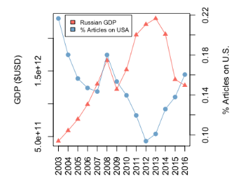

# Precog Paper Report

Authoritarian countries like China and Russia are well known for using media manipulation techniques like fake news and censorship. But a few of these might be subtle, like flooding communication channels with distracting information or highlighting very specific viewpoints.

This work proposed a method that combines economics, NLP techniques and political science to understand how the Russian media makes use of such techniques.

# Agenda Setting

Decide what is news-worthy by covering some topics more extensively as compared to others. This can sway the opinion of the public. The authors hypothesize that in countries with weak democratic institutions and government-controlled media, the government can use this to shape opinion.

For example, in Russia, news coverage of the USA is used to distract public opinion from negative economic events. US coverage is defined as the ration of the number of articles that mention the US atleast twice to the total number of articles in any time slice.

US mentions vs Russia’s GDP

A strong negative correlation occurs here (even after extending with article level and word level analysis) - the mentions of US increase as Russian stock and GDP fall. **Exception** - US Elections coinciding with a peak of the Russian GDP.

Does this imply causality? Use Granger’s Causality to find out

The table indicates that the decline in the stock market for 1-lag is negative and significant suggesting that decline in the stock market causes US mentions to increase. 2-lag is not significant indicating that the changes usually follow within a month and not beyond that time frame.

# Framing

Framing refers to the way information is presented and structured to influence how the audience perceives an issue or topic.

Several aspects of framing make it difficult to analyse:

- The same frame could have different sentiments or stances.
- A single article could also have different frames.

Recent work has tried to remedy this by defining broad framing categories. But framing a corpus is a labour intensive process.

Probabilistic topic models:

- Show what themes are salient in a corpus however they are specific to the corpus and are hard to interpret.

The MFC (Media Frame Corpus) can be used to get the primary frame of the article or can be used to train classifiers to identify language related to the framing but these are only usable in the case of the English Language.

Problem

- Lot of labour required to generate annotations
- Not possible to use supervised methods since it needs annotated data in that language in the first place
- Could use topic models that are unsupervised but its difficult to compare outputs across corpora since topics may be different.

Goal - develop a method that is easy to interpret and is applicable across languages. 

# Method

The author ground their method in the annotations in the MFC but do not go with a fully-supervised method. 

- They use the annotations to derive the lexicon for each frame and then translate that into Russian.
- They use query-expansion to reduce the noisiness of machine translation and make the lexicons specific to the corpus they use.
- This lexicon is used to analyse the frames of the corpus and identify the sources of media manipulation.

## Creating Frame Lexicons

Compute $I$ which indicates the importance of the word for the frame across the corpus- use top 250 words but discard those that have >98% occurrence or <5% occurrence in documents.

## Translating and Query-Expansion

Train a 200-dimensional embeddings on a large background corpus in the test language using a CBOW with a 5-word context window and find K nearest neighbours to the center of the lexicon by summing the embeddings for all the words in the lexicon.

A document is said to contain F, if it contains atleast 3 instances of a word from F’s lexicon. The most common frame is the primary frame for the document and is determined by the number of words from each framing lexicon in the document.

# Evaluations

## English Evaluation

- Evaluate the english lexicons using
    - Primary frame identification
        - Model performs comparably to similar methods but crucially it can be applied other domains or languages without needing more annotated data
    - Identifying every frame
        - Salience of the frames in general is the more important task - multiple annotators so every document will have multiple frames courtesy of an annotator.
        - Consider a frame to be part of the document if atleast three tokens of its lexicon are present in the document.
        - This a novel task proposed and is compared with a logistic regression baseline against which it outperforms on almost all frames even though it is distantly supervised.

## Russian Evaluations

- Annotators who are presented with a frame heading and a set of six words, out of which five words are randomly sampled from the framing lexicon of the given frame (Frus), and one word is sampled from a lexicon of a different frame with no overlap with Frus.
- The annotators are asked to identify which word does not belong in the set (intruder word)
- Two forms of accuracy: soft and hard accuracy, which requires atleast one and both annotators to agree on the intruder word respectively.
- Average precision, which indicates the average number of annotators who correctly identified the intruder word across all sets.

## Vs. Topic Modelling

This approach effectively identifies frames and connects articles to higher-level concepts while STMs may not be closely related.

# Analysis

A number of frames have strong associations with the US, and an analysis of articles reveals that they promote Russian unity and signify a difference with the US culture and systems.

An analysis of words within the frames highlights that as the stock market declines, articles villainize the US, describe threats to it, and promote Russia’s safety over the US.

# Novelty and Contributions

- Introduction of a new method to project framing annotations in English to Russian, without the use of annotated data in Russian providing a new means to analyse frames in different languages even without its annotations. This can be applied to Indian politics and media as well.
- Simple and replicable methods which can serve as a starting point for the analysis of subtle media manipulation strategies.

# Problems?

- Lack of a sentiment specific analysis of frames: The frames can be posed in any sentiment or stance which makes a sentiment-based analysis of the frames necessary. However, they only look at some examples of articles to figure out the sentiment of the frame across the entire corpus. This works well here because the source of the corpus is government-controlled, but may fail when applied to sources of media in other countries where ties to the government or allegiances may not be too clear or is not too much either.
- Focus on only one corpus: The source of the corpus is known to be heavily influenced by the government which drives the conclusions made by the paper about the Russian media on the whole. Needs a bigger corpus including all types of Russian media across the same time frame. This may effect the accuracy of the frame translation considering the lexicon or language used may not be the same.
- Low accuracy of steps may stack up: The accuracy levels of each individual step starting from the MFC frames are relatively low, and combining them could lead to a significantly lower overall accuracy.
- Lot of heuristics being applied which may potentially change as its being applied to the Indian media.

# Applications to PreCog

- A direct application of the project idea is possible in the Indian context.
- To extend this we can take a look at different spectrums of the media including those that are biased towards the ruling party and those that are largely independent and analyse how behaviour changes.
- Take a look at mentions of different people from the perspective of the government - Congress, Pakistan, China, etc since there is no single “enemy”.